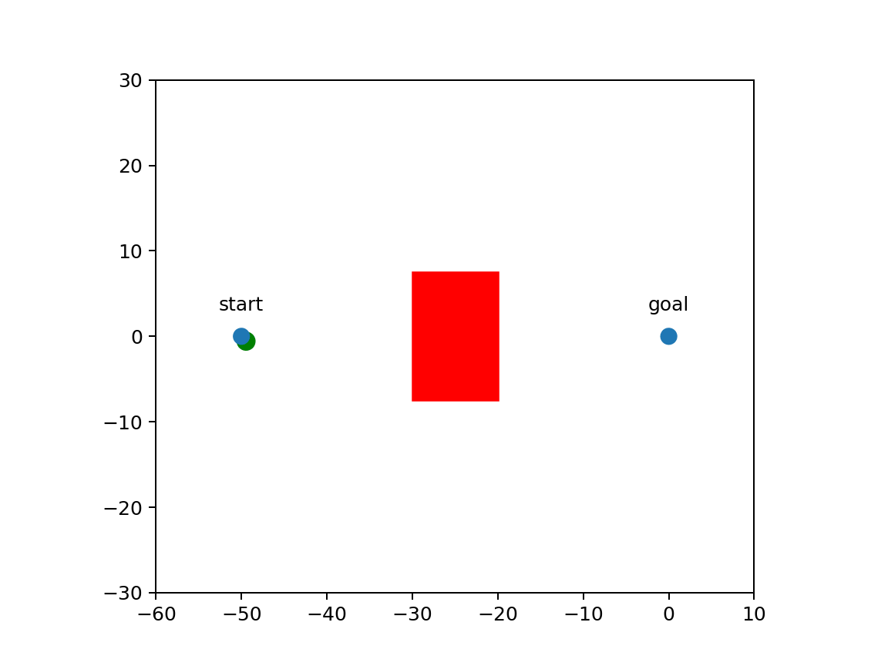
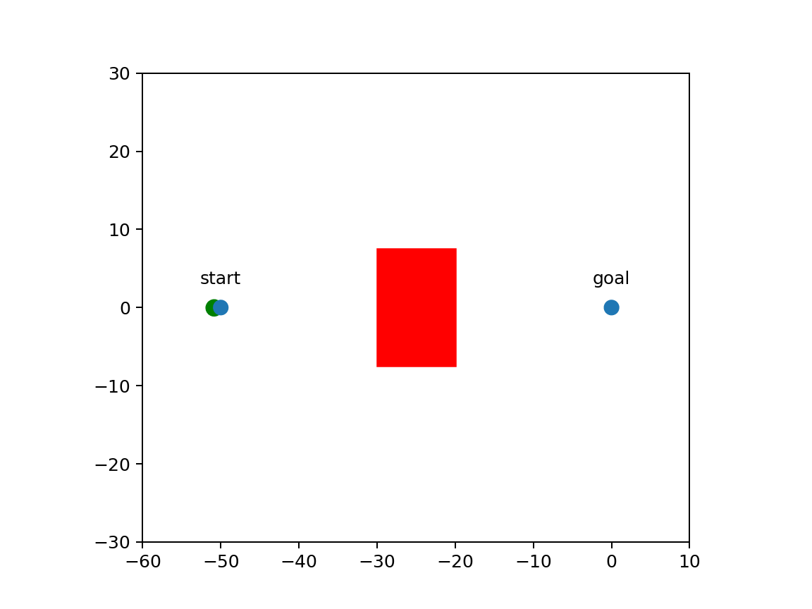

#### Adversarial Behavioral Exploration for Safe Reinforcement Learning  (AdvEx-RL)
This is the code repository of the paper "Adversarial Behavioral Exploration for Safe Reinforcement Learning". Paper link: [IJCAI23](https://www.ijcai.org/proceedings/2023/54)

#### Instructions:
Follow the instruction written inside the **READ_ME_INSTRUCTIONS.txt** file

#### AdvEx-RL agent under 100% adversarial attack:

#### SAC agent under 100% adversarial attack:

